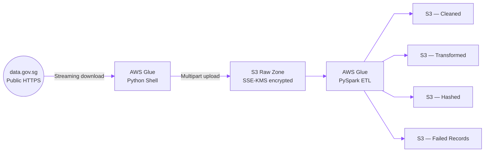
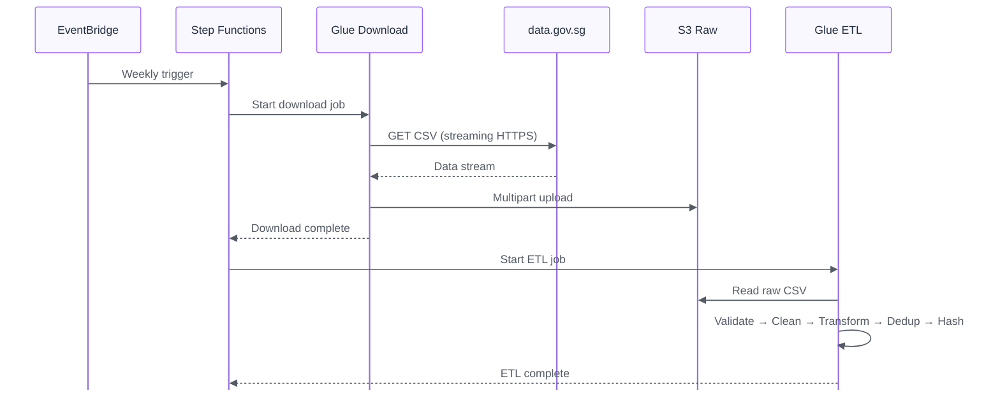
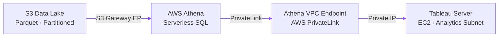
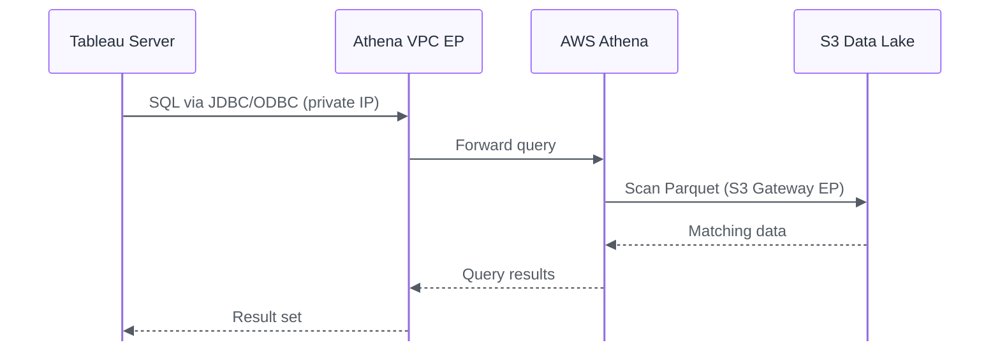
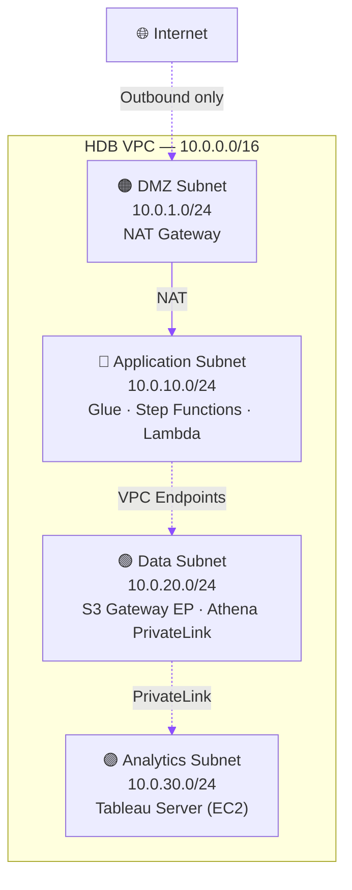

# HDB AWS Architecture Design

> A serverless, cost-effective architecture for ingesting, processing, and analysing HDB resale flat price data within a secure AWS environment.

---

## Table of Contents

1. [Overview](#overview)
2. [Design Assumptions](#design-assumptions)
3. [Data Ingestion Architecture](#data-ingestion-architecture)
4. [Data Exploitation Architecture](#data-exploitation-architecture)
5. [Security & Network Segmentation](#security--network-segmentation)
6. [Monthly Cost Estimate](#monthly-cost-estimate)
7. [Component Reference](#component-reference)
8. [Glossary](#glossary)

---

## Overview

This document describes the end-to-end AWS architecture for HDB's resale flat price analytics platform. The platform performs two core functions:

**Ingestion** — A weekly, fully automated pipeline downloads CSV data from `data.gov.sg`, applies cleaning and transformation logic, and stores the results in an S3-based data lake.

**Exploitation** — Tableau Server, running on EC2 inside a private VPC, queries the processed data through Amazon Athena. All traffic remains within the VPC via AWS PrivateLink and Gateway Endpoints — nothing traverses the public internet.

The design prioritises security (encryption at rest and in transit, no public-facing compute), cost efficiency (serverless processing, S3 + Athena instead of RXedshift), and operational simplicity (EventBridge scheduling, Glue-managed ETL).

---

## Design Assumptions

| # | Assumption |
|---|------------|
| 1 | HDB operates a single **private VPC** with dedicated subnets for each tier (DMZ, Application, Data, Analytics). |
| 2 | `data.gov.sg` exposes resale flat price datasets as CSV files via **public HTTPS download URLs**. |
| 3 | The data science team runs **Tableau Server on EC2** inside the private Analytics subnet. |
| 4 | Total dataset size remains **< 5 TB**, making Athena + S3 cost-effective without Redshift. |
| 5 | Data refreshes are **weekly** (batch); real-time streaming is not required. |
| 6 | IAM roles and policies are in place but are not explained in detail. |

---

## Data Ingestion Architecture

### Objective

Pull HDB resale flat price CSVs from `data.gov.sg` into HDB's private data platform on a weekly schedule, applying cleaning, transformation, deduplication, anomaly detection, and hashing.

### Architecture Diagram

### Step-by-Step Flow

| Step | Action | Detail |
|------|--------|--------|
| **1. Trigger** | Amazon EventBridge fires a scheduled rule every **Sunday at 02:00 SGT**. | The rule starts an AWS Step Functions state machine that orchestrates the downstream jobs. |
| **2. Download** | A **Glue Python Shell** job downloads the CSV from `data.gov.sg` via streaming HTTPS. | Files > 100 MB are handled by writing chunks directly to S3 using multipart upload. The job runs in the Application subnet and reaches the internet through the NAT Gateway in the DMZ subnet. |
| **3. Land** | The raw CSV is written to the **S3 Raw Zone**. | The bucket is encrypted with SSE-KMS and only accessible from within the VPC via the S3 Gateway Endpoint. |
| **4. ETL** | A **Glue PySpark** job reads the raw file and executes the processing pipeline. | Stages: schema validation → data cleaning → lease recomputation → deduplication → anomaly detection → SHA-256 hashing. Logic is ported from the existing jupyter notebook. |
| **5. Output** | Processed records are written to four destination zones in S3. | **Cleaned** (valid records), **Transformed** (enriched/recomputed fields), **Hashed** (PII-masked), and **Failed Records** (rows that did not pass validation). |

### Sequence Diagram

---

## Data Exploitation Architecture

### Objective

Enable Tableau users to query the processed HDB resale data securely, with all traffic remaining within the private VPC.

### Architecture Diagram

### Step-by-Step Flow

| Step | Action | Detail |
|------|--------|--------|
| **1. Storage format** | Processed data is stored as **Parquet** files in S3. | Parquet provides columnar compression and predicate push-down, yielding faster and cheaper Athena queries compared to CSV. |
| **2. Cataloguing** | The **AWS Glue Data Catalog** registers table schemas. | Tables are partitioned by `year` and `month` to minimise the volume of data scanned per query. |
| **3. Connection** | Tableau Server connects to Athena via the **Athena ODBC/JDBC driver**. | The driver is installed on the Tableau EC2 instance and configured to use the VPC endpoint. |
| **4. Private path** | All query traffic flows through an **Athena VPC Interface Endpoint (PrivateLink)**. | No data leaves the VPC; there is no internet-facing path between Tableau and Athena. |
| **5. Query execution** | Tableau sends SQL → Athena scans S3 via the **S3 Gateway Endpoint** → results return privately to Tableau. | Users experience standard Tableau interactions; the private networking is transparent. |

### Sequence Diagram

---

## Security & Network Segmentation

### VPC Layout

> **Design principle:** Only the DMZ subnet has a route to the internet (via NAT Gateway for outbound-only traffic). All other subnets are fully private — no public IP addresses are assigned to any compute resource.

### Security Controls

| Layer | Control | Detail |
|-------|---------|--------|
| **Network isolation** | Private subnets with no internet gateway | All compute (Glue, EC2) runs in private subnets. Outbound internet access is limited to the NAT Gateway in the DMZ. |
| **Data in transit** | VPC Endpoints for all AWS service traffic | S3 Gateway Endpoint (free) and Athena PrivateLink ensure traffic never leaves the AWS backbone. |
| **Data at rest** | SSE-KMS encryption on all S3 buckets | AWS KMS–managed keys encrypt every object written to the data lake. |
| **Access control** | S3 bucket policies with VPC endpoint conditions | Bucket policies include `aws:sourceVpce` conditions that deny any request not originating from the designated VPC Endpoint. |
| **Segmentation** | Per-subnet route tables and NACLs | Each tier (DMZ, App, Data, Analytics) has its own route table and network ACL, limiting lateral movement between tiers. |

### VPC Endpoints

| Endpoint | Type | Cost | Purpose |
|----------|------|------|---------|
| S3 Gateway Endpoint | Gateway | Free | Private access to S3 without routing through NAT or the internet. |
| Athena Interface Endpoint | PrivateLink | ~$7.50/month | Private connectivity from Tableau Server to Athena. |

---

## Cost Estimate (Monthly)

The table below provides both a **realistic** estimate (based on expected workload) and a **conservative** upper bound for budgeting purposes. All prices are based on published AWS rates for the Singapore region (`ap-southeast-1`).

| Service | Realistic | Conservative | Notes |
|---------|-----------|--------------|-------|
| S3 Storage (~50 GB) | ~\$1.25 | ~\$1.50 | Standard tier at ~\$0.025/GB; includes PUT/GET request costs. |
| AWS Glue (2 jobs/week) | ~\$3 | ~\$10 | 1 DPU Python Shell (~5 min) + 2 DPU PySpark (~15 min) at \$0.44/DPU-hr. Conservative estimate assumes longer runtimes or higher DPU allocation. |
| Athena (~20 queries/week) | ~\$0.20 | ~\$1 | \$5/TB scanned. Parquet format and year/month partitioning reduce scan volume dramatically; each query typically scans 50–500 MB. |
| NAT Gateway | ~\$43.07 | ~\$50.07 | \$0.059/hr x 730 hrs = ~\$43.07 (ap-southeast-1 rate). Conservative adds a buffer (~\$7) for data processing charges at \$0.059/GB. |
| VPC Endpoints (1 Interface) | ~\$7.30 | ~\$14.60 | Athena PrivateLink only — S3 Gateway Endpoint is free. ~\$7.30 per AZ; conservative assumes 2 AZs for high availability. |
| **Total** | **~\$54.82** | **~\$77.17** | |

---

## Component Reference

| Function | AWS Service | Notes |
|----------|-------------|-------|
| Scheduling | Amazon EventBridge | Cron-based weekly trigger (Sunday 02:00 SGT). |
| Orchestration | AWS Step Functions | Coordinates download and ETL jobs; handles retries and error states. |
| Data download | AWS Glue (Python Shell) | Lightweight job for streaming HTTPS download to S3. |
| Data processing | AWS Glue (PySpark) | Distributed ETL: cleaning, transformation, deduplication, hashing. |
| Data storage | Amazon S3 | Raw, Cleaned, Transformed, Hashed, and Failed Records zones — all SSE-KMS encrypted. |
| Data catalogue | AWS Glue Data Catalog | Stores schemas and partition metadata for Athena. |
| Query engine | Amazon Athena | Serverless SQL over S3; no infrastructure to manage. |
| BI / Analytics | Tableau Server on EC2 | Connects to Athena via JDBC/ODBC driver over PrivateLink. |
| Private networking | VPC Endpoints | S3 Gateway Endpoint + Athena PrivateLink — no public internet for data traffic. |

---

## Glossary

| Term | Definition |
|------|------------|
| **DMZ** | Demilitarised Zone — a network segment that acts as a buffer between the public internet and internal private subnets. |
| **ETL** | Extract, Transform, Load — the process of pulling raw data, processing it, and writing the results to a target store. |
| **NAT Gateway** | Network Address Translation Gateway — allows resources in private subnets to initiate outbound internet connections without being directly reachable from the internet. |
| **NACL** | Network Access Control List — a stateless firewall applied at the subnet level in a VPC. |
| **Parquet** | A columnar file format optimised for analytical queries; supports compression and predicate push-down. |
| **PrivateLink** | An AWS technology that provides private connectivity between VPCs and AWS services without using public IPs or traversing the internet. |
| **SSE-KMS** | Server-Side Encryption with AWS Key Management Service — encrypts objects in S3 using KMS-managed keys. |
| **VPC** | Virtual Private Cloud — an isolated virtual network within AWS. |

---

*End of document.*
