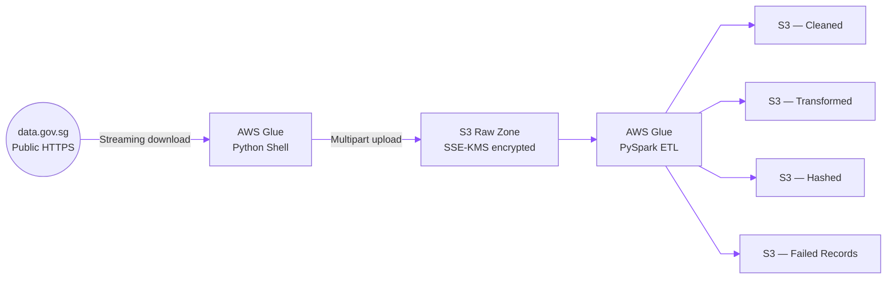
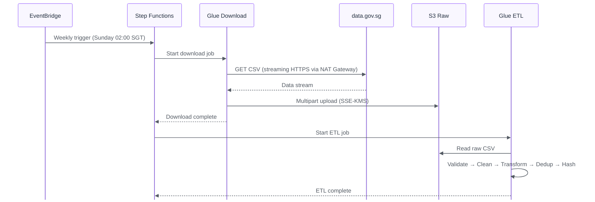
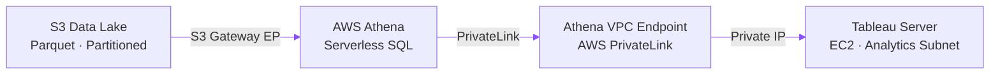
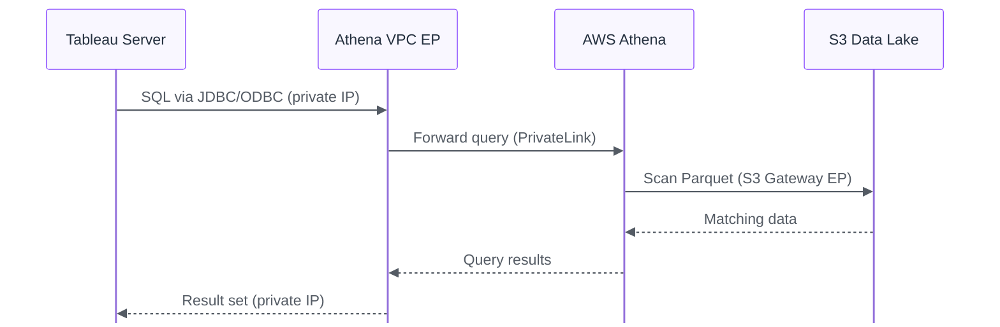
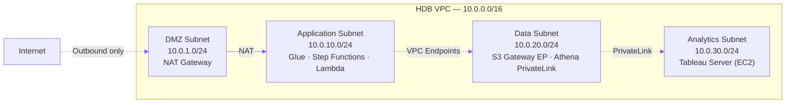

# HDB AWS Data Architecture Design

> Turning publicly available HDB resale flat price data into trusted, query-ready insights, automatically, securely, and at an affordable price for HDB.

---

## Table of contents

1. [Key Functions](#key-functions)
2. [Design Assumptions](#design-assumptions)
3. [Data Ingestion Architecture](#data-ingestion-architecture)
4. [Data Exploitation Architecture](#data-exploitation-architecture)
5. [Security & Network Segmentation](#security--network-segmentation)
6. [Operational Considerations](#operational-considerations)
7. [Monthly Cost Estimate](#monthly-cost-estimate)
8. [Component Reference](#component-reference)
9. [Glossary](#glossary)

---

## Key functions

The proposed architecture serves two core functions:

**Ingestion**: A weekly, fully automated pipeline downloads CSV data from `data.gov.sg`, applies cleaning and transformation logic, and stores the results in an S3-based data lake.

**Exploitation**: Tableau Server, running on EC2 inside a private VPC, queries the processed data through Amazon Athena. All traffic stays within the VPC via AWS PrivateLink and Gateway Endpoints.

### Key design decisions

Here's the rationale behind a few design chocies (non-exhaustive):

| Decision | Why |
|----------|-----|
| **Athena + S3 instead of Redshift** | The dataset is small (< 5 TB) and queried infrequently. Redshift would provide faster concurrent queries but costs ~\$180+/month for even a single-node cluster, which is more than double the cost of this entire platform. Athena's pay-per-query model is a better fit here. |
| **Parquet instead of CSV for processed data** | Parquet is a columnar format, which means Athena can skip irrelevant columns entirely and benefit from built-in compression. This reduces both query time and cost (Athena charges by data scanned). A typical query against Parquet scans 10–100× less data than the same query against CSV. |
| **NAT Gateway for data download** | The NAT Gateway is the single most expensive component (~78% of the monthly bill). Unfortunately, it's unavoidable: `data.gov.sg` is a public internet endpoint, and resources in private subnets need the NAT Gateway to reach it. There is no AWS PrivateLink equivalent for external government APIs. |
| **Serverless processing (Glue) instead of EC2-based ETL** | Glue jobs spin up only when needed and shut down immediately after. There are no servers to patch, scale, or pay for during idle time. For a weekly batch workload, this is significantly cheaper and simpler than maintaining dedicated EC2 instances. |

---

## Design assumptions

| # | Assumption | Risk |
|---|------------|------|
| 1 | HDB operates a single **private VPC** with dedicated subnets for each tier (DMZ, Application, Data, Analytics). | Low; standard enterprise network design. |
| 2 | `data.gov.sg` exposes resale flat price datasets as CSV files via **public HTTPS download URLs**. | Medium; if the API or URL structure changes, manual intervention is required to update the download job. |
| 3 | The data science team runs **Tableau Server on EC2** inside the private Analytics subnet. | Low; assumes existing Tableau infrastructure. |
| 4 | Total dataset size remains **< 5 TB**, making Athena + S3 cost-effective without Redshift. | Medium; if data volume grows significantly (e.g., additional datasets are onboarded), the architecture may need need to be re-evaluated. A possible safeguard is to set a CloudWatch alarm on S3 bucket size. |
| 5 | Data refreshes are **weekly** (batch); real-time streaming is not required. | Low; HDB resale data is published periodically, not in real time. |
| 6 | IAM roles and policies are in place but are not detailed in the provided document. | Low; standard operational prerequisite. |

---

## Data ingestion architecture

### Objective

We need to pull HDB resale flat price CSVs from `data.gov.sg` into HDB's private data platform on a weekly schedule, applying cleaning, transformation, deduplication, anomaly detection, and hashing.

### Architecture diagram

### Step-by-Step flow

| Step | Action | Detail |
|------|--------|--------|
| **1. Trigger** | Amazon EventBridge fires a scheduled rule every **Sunday at 02:00 SGT**. | The rule starts an AWS Step Functions state machine that orchestrates the downstream jobs. |
| **2. Download** | A **Glue Python Shell** job downloads the CSV from `data.gov.sg` via streaming HTTPS. | For files larger than 100 MB, the job writes chunks directly to S3 using multipart upload. The job runs in the Application subnet and reaches the internet through the NAT Gateway in the DMZ subnet. |
| **3. Land** | The download job writes the raw CSV to the **S3 Raw Zone**. | The bucket is encrypted with SSE-KMS. Access is restricted to requests originating from the VPC via the S3 Gateway Endpoint. |
| **4. ETL** | A **Glue PySpark** job reads the raw file and runs the processing pipeline. | The pipeline executes in sequence: schema validation → data cleaning → lease recomputation → deduplication → anomaly detection → SHA-256 hashing. The logic is ported from the team's existing Jupyter notebook. |
| **5. Output** | The ETL job writes processed records to four destination zones in S3. | **Cleaned** — valid records that passed all checks. **Transformed** — records enriched with recomputed fields (e.g., remaining lease). **Hashed** — records with PII columns replaced by SHA-256 hashes. **Failed Records** — rows that did not pass schema validation or anomaly checks. |

### What happens to failed records?

The ETL job writes any records that fail validation or anomaly detection to a dedicated `s3://…/failed-records/` prefix, partitioned by processing date. This enables the data engineering team to review failed records in context and investigate potential data quality issues efficiently.

At present, failed records are reviewed manually. As a future enhancement, the pipeline could publish an Slack/Teams notification whenever the number of failed records exceeds a configurable threshold (via a POST API call). This would provide timely visibility into potential data quality issues, allowing the team to investigate and respond before failures accumulate unnoticed.

### Sequence diagram

Once the processed data lands in S3, we need to allow the data to reach the analytics team, which is where the exploitation layer comes in.

---

## Data exploitation architecture

### Objective

Give Tableau users a fast, SQL-based interface to the processed HDB resale data whilst allowing every byte of traffic staying inside the private VPC.

### Architecture Diagram

### Step-by-Step Flow

| Step | Action | Detail |
|------|--------|--------|
| **1. Storage format** | The ETL job stores processed data as **Parquet** files in S3. | Parquet's columnar layout means Athena reads only the columns a query actually needs, and built-in compression shrinks file sizes dramatically. This results in faster queries that scan less data and cost less. |
| **2. Cataloguing** | The **AWS Glue Data Catalog** registers table schemas and partition metadata. | Tables are partitioned by `year` and `month`. When a Tableau user filters by date range, Athena skips partitions outside that range entirely, avoiding full-table scans = time and money saved. |
| **3. Connection** | Tableau Server connects to Athena through the **Athena ODBC/JDBC driver**. | The driver is installed on the Tableau EC2 instance and configured to route queries through the VPC endpoint (not the public Athena endpoint). |
| **4. Private path** | All query traffic flows through an **Athena VPC Interface Endpoint (PrivateLink)**. | Nothing leaves the VPC. There is no internet-facing path between Tableau and Athena. |
| **5. Query execution** | Tableau sends SQL → Athena scans S3 via the **S3 Gateway Endpoint** → results return privately to Tableau. | From the analyst's perspective, this would feel like any standard Tableau data connection.|

### Sequence Diagram

---

## Security & Network Segmentation

### VPC Layout

The VPC is divided into four purpose-specific subnets. Traffic flows in one direction primarily from the DMZ inward and each tier is isolated from the others by dedicated route tables and network ACLs.

**The core principle is that:** only the DMZ subnet has a route to the internet, and that route is outbound-only (via the NAT Gateway). No compute resource in any subnet has a public IP address. If an attacker compromised a single component, the subnet boundaries and route tables would limit lateral movement.

### Security Controls

| Layer | Control | What it does |
|-------|---------|--------------|
| **Network isolation** | Private subnets with no internet gateway | All compute (Glue, EC2) runs in private subnets. The only path to the internet is the NAT Gateway in the DMZ and it only allows outbound connections. |
| **Data in transit** | VPC Endpoints for all AWS service traffic | The S3 Gateway Endpoint and Athena PrivateLink keep traffic on the AWS backbone. Nothing is routed over the public internet. |
| **Data at rest** | SSE-KMS encryption on all S3 buckets | Every object written to the data lake is encrypted using AWS KMS–managed keys. Even if someone gained direct access to the underlying storage, the data would be unreadable without the KMS key which would be stored as a env var. |
| **Access control** | S3 bucket policies with VPC endpoint conditions | Bucket policies include `aws:sourceVpce` conditions that reject any request not originating from the designated VPC Endpoint. This means the data is inaccessible even from other AWS accounts or VPCs. |
| **Segmentation** | Per-subnet route tables and NACLs | Each tier (DMZ, App, Data, Analytics) has its own route table and network ACL. This limits blast radius (i.e., a misconfiguration in one tier cannot directly affect another.) |

### VPC Endpoints

| Endpoint | Type | Cost | Purpose |
|----------|------|------|---------|
| S3 Gateway Endpoint | Gateway | Free | Gives private subnets direct access to S3 without routing through the NAT Gateway (saving both latency and cost). |
| Athena Interface Endpoint | PrivateLink | ~\$7.50/month per AZ | Lets Tableau query Athena over a private IP address instead of a public endpoint. |

---

## Operational Considerations

This section outlines the most likely failure scenarios and how the platform handles (or should handle) them.

| Scenario | Impact | Current Mitigation | Recommended Enhancement |
|----------|--------|---------------------|-------------------------|
| **`data.gov.sg` is down** during the scheduled run | The download job fails; no new data is ingested that week. | Step Functions retries the download job with exponential backoff (configurable). If all retries fail, the state machine transitions to a `FAILED` state. | Add an SNS alert on state machine failure so the team is notified immediately rather than discovering the gap later. |
| **CSV schema changes** (e.g., columns renamed or added) | The Glue ETL job fails at the schema validation stage. | The schema validation step catches mismatches and writes the entire file to the Failed Records zone. | Add a CloudWatch alarm on ETL job failures. Consider a lightweight "schema drift detection" step that compares incoming headers against the expected schema before processing begins. |
| **Glue job runs longer than expected** | Increased cost (billed per DPU-hour). In extreme cases, the job could time out. | Glue jobs have a configurable timeout (default: 48 hours). | Set a reasonable timeout (e.g., 1 hour) and pair it with a CloudWatch alarm. Monitor DPU-hour trends over time to catch gradual increases. |
| **S3 bucket fills beyond 5 TB** | Athena queries may become slower or more expensive. The cost model assumptions no longer hold. | No current mitigation. | Set a CloudWatch alarm on the `BucketSizeBytes` metric. If the threshold is approached, evaluate whether to introduce S3 lifecycle policies (e.g., archiving old partitions to Glacier) or migrate to Redshift. |
| **NAT Gateway becomes a bottleneck** | Unlikely at current data volumes, but large file downloads could incur significant data processing charges. | NAT Gateway scales automatically. | Monitor `BytesOutToDestination` and `BytesOutToSource` metrics. If data transfer costs grow, consider switching to a NAT instance for large downloads (trading availability for cost). |

### Infrastructure as Code

The entire platform is designed to be provisioned and versioned as code using **Terraform** (AWS CloudFormation is a viable AWS-native alternative). Every component described in this document: the VPC and its four subnets, VPC Endpoints, IAM roles, SSE-KMS-encrypted S3 buckets, Glue jobs, the EventBridge schedule, and the Step Functions state machine. This enables:

- **Reproducibility** — a single `terraform apply` builds the full environment, with no click-ops or configuration drift.
- **Version-controlled change** — infrastructure updates go through the same git history and code review as application code.
- **Safe iteration** — `terraform plan` previews the exact diff before anything changes, and environments can be spun up or torn down on demand for testing.
- **CI/CD alignment** — configuration is deployed through a pipeline, consistent with the DataOps operating model.

---

## Monthly Cost Estimate

The table below shows both a **realistic** estimate based on expected workload and a **conservative** upper bound for budgeting. All prices reflect published AWS rates for the Singapore region (`ap-southeast-1`).

| Service | Realistic | Conservative | Why it costs this much |
|---------|-----------|--------------|------------------------|
| S3 Storage (~50 GB) | ~\$1.25 | ~\$1.50 | Standard tier at ~\$0.025/GB. Includes PUT/GET request costs, which are negligible at this scale. |
| AWS Glue (2 jobs/week) | ~\$3 | ~\$10 | 1 DPU Python Shell (~5 min) + 2 DPU PySpark (~15 min) at \$0.44/DPU-hr. The conservative estimate accounts for longer runtimes or higher DPU allocation during peak loads. |
| Athena (~20 queries/week) | ~\$0.20 | ~\$1 | \$5/TB scanned. Parquet format and year/month partitioning reduce scan volume dramatically — each query typically scans 50–500 MB, not gigabytes. |
| NAT Gateway | ~\$43.07 | ~\$50.07 | \$0.059/hr × 730 hrs = ~\$43.07. This is the fixed hourly cost and is unavoidable as long as the platform needs to reach `data.gov.sg`. The conservative estimate adds ~\$7 for data transfer charges at \$0.059/GB. |
| VPC Endpoints (1 Interface) | ~\$7.30 | ~\$14.60 | Athena PrivateLink at ~\$7.30 per AZ. The S3 Gateway Endpoint is free. The conservative estimate assumes deployment across 2 AZs for high availability. |
| **Total** | **~\$54.82** | **~\$77.17** | |

---

## Component Reference

| Function | AWS Service | Why this service |
|----------|-------------|------------------|
| Scheduling | Amazon EventBridge | Native cron support with no infrastructure to manage. Triggers reliably at Sunday 02:00 SGT. |
| Orchestration | AWS Step Functions | Visual workflow with built-in retry logic, error handling, and state tracking. Makes it easy to see exactly where a pipeline failed. |
| Data download | AWS Glue (Python Shell) | Lightweight, serverless Python runtime — ideal for a simple HTTP download without the overhead of a full Spark cluster. |
| Data processing | AWS Glue (PySpark) | Distributed ETL that scales with data volume. Handles cleaning, transformation, deduplication, and hashing in a single job. |
| Data storage | Amazon S3 | Durable, inexpensive object storage. Organised into Raw, Cleaned, Transformed, Hashed, and Failed Records zones — all SSE-KMS encrypted. |
| Data catalogue | AWS Glue Data Catalog | Stores table schemas and partition metadata so Athena knows how to query the data without manual configuration. |
| Query engine | Amazon Athena | Serverless SQL over S3. No clusters to provision, no idle costs — you pay only for the data each query scans. |
| BI / Analytics | Tableau Server on EC2 | The team's existing BI tool. Connects to Athena via JDBC/ODBC and presents data through familiar dashboards and visualisations. |
| Private networking | VPC Endpoints | S3 Gateway Endpoint (free) + Athena PrivateLink (~\$7.30/month) keep all data traffic off the public internet. |

---

